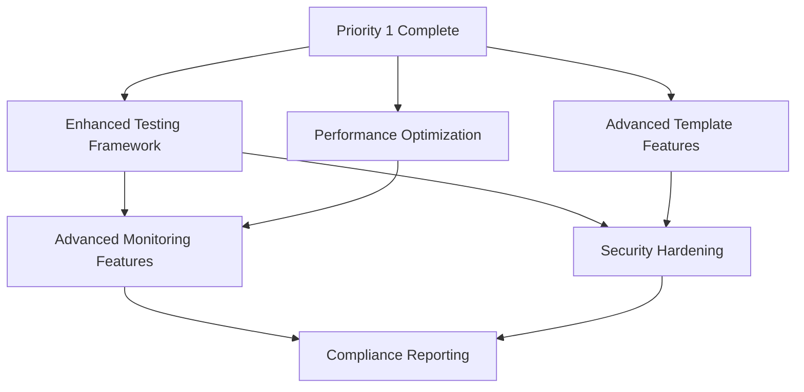

# Priority 2 & 3 Components Analysis

## Overview

This document provides detailed specifications for Priority 2 and Priority 3 components identified from the IMPLEMENTATION_PLAN.md and PROGRESS_TRACKER.md analysis. These components represent the next phases of homelab project enhancement.

**Analysis Date**: January 2025  
**Status**: Phase 2 Planning - Component Specifications  
**Dependencies**: Based on existing solid foundation with all Priority 1 components complete

## Priority 2 Components (Next Implementation Phase)

### 1. Enhanced Testing Framework

**Current Status**: Basic framework exists (test_functions.sh, test_template_creation.sh, test_logging.sh)  
**Priority**: Medium Impact - Ready for Implementation  
**Estimated Effort**: 2-3 weeks

#### Gaps Identified

1. **Performance Testing & Benchmarking**
   - Missing: Performance benchmarks for template creation workflows
   - Missing: Load testing for concurrent operations
   - Missing: Resource usage profiling across modules

2. **Security Testing & Vulnerability Scanning**
   - Missing: Automated security vulnerability scanning
   - Missing: Configuration security validation
   - Missing: Penetration testing capabilities

3. **CI/CD Pipeline Integration**
   - Missing: Automated test execution on code changes
   - Missing: Test result reporting and metrics
   - Missing: Regression testing automation

4. **Test Coverage & Reporting**
   - Missing: Code coverage analysis
   - Missing: Test metrics dashboard
   - Missing: Historical test performance tracking

#### Implementation Specifications

**Technical Requirements**:
```bash
# Enhanced test framework structure
scripts/
├── test_framework.sh          # Main test orchestrator (exists)
├── test_performance.sh        # NEW: Performance benchmarking
├── test_security.sh           # NEW: Security scanning
├── test_integration.sh        # NEW: End-to-end integration tests
├── test_regression.sh         # NEW: Automated regression testing
└── lib/
    ├── test_utils.sh          # NEW: Test utilities
    ├── benchmark_utils.sh     # NEW: Performance utilities
    └── security_utils.sh      # NEW: Security testing utilities
```

**Integration Points**:
- Extends existing `scripts/lib/logging.sh` for test logging
- Integrates with configuration management for test environments
- Uses existing module structure for comprehensive testing
- Connects with monitoring system for test metrics

**Dependencies**:
- Existing test modules (test_functions.sh, test_template_creation.sh, test_logging.sh)
- Configuration management system (scripts/config.sh)
- Logging system (scripts/lib/logging.sh)
- All modules for comprehensive testing coverage

#### Implementation Approach

**Phase 1: Performance Testing** (Week 1)
1. Implement benchmark utilities in `scripts/lib/benchmark_utils.sh`
2. Create performance testing module `scripts/test_performance.sh`
3. Add benchmarking to existing test modules
4. Integrate with monitoring system for metrics collection

**Phase 2: Security Testing** (Week 2)  
1. Implement security utilities in `scripts/lib/security_utils.sh`
2. Create security testing module `scripts/test_security.sh`
3. Add vulnerability scanning capabilities
4. Integrate security validation into existing tests

**Phase 3: CI/CD & Reporting** (Week 3)
1. Create test orchestration improvements
2. Implement test reporting and metrics
3. Add regression testing automation
4. Create test dashboard integration

### 2. Advanced Template Features

**Current Status**: Core template functionality complete (template.sh - 2814 lines)  
**Priority**: Medium Impact - Ready for Implementation  
**Estimated Effort**: 3-4 weeks

#### Gaps Identified

1. **Custom Cloud-Init Script Execution**
   - Missing: Custom script execution via cloud-init
   - Missing: Script validation and error handling
   - Missing: Script library and templates

2. **Template Security Hardening**
   - Missing: Automated security hardening profiles
   - Missing: Security policy enforcement
   - Missing: Vulnerability assessment for templates

3. **Template Performance Optimization**
   - Missing: Performance optimization profiles
   - Missing: Resource allocation optimization
   - Missing: Template performance benchmarking

4. **Template Lifecycle Management**
   - Missing: Template versioning system
   - Missing: Template backup and restore
   - Missing: Template sharing and marketplace features

#### Implementation Specifications

**Technical Requirements**:
```bash
# Enhanced template system structure
scripts/
├── template.sh                # Main template module (exists)
├── template_security.sh       # NEW: Security hardening
├── template_performance.sh    # NEW: Performance optimization
├── template_lifecycle.sh      # NEW: Versioning and backup
├── template_marketplace.sh    # NEW: Sharing and marketplace
└── lib/
    ├── cloudinit_utils.sh     # NEW: Advanced cloud-init utilities
    ├── security_profiles.sh   # NEW: Security hardening profiles
    └── performance_profiles.sh # NEW: Performance optimization
```

**Integration Points**:
- Extends existing template.sh module with advanced features
- Integrates with configuration management for template settings
- Uses security hardening for template validation
- Connects with backup system for template preservation

**Dependencies**:
- Existing template.sh module (core functionality)
- Configuration management system
- Security hardening components (Priority 3)
- Backup and restore system

#### Implementation Approach

**Phase 1: Custom Cloud-Init Features** (Week 1)
1. Implement cloud-init utilities in `scripts/lib/cloudinit_utils.sh`
2. Add custom script execution to template.sh
3. Create script validation and error handling
4. Add script library and templates

**Phase 2: Security & Performance** (Week 2-3)
1. Implement security hardening profiles
2. Add performance optimization capabilities
3. Create automated security validation
4. Add performance benchmarking for templates

**Phase 3: Lifecycle Management** (Week 4)
1. Implement template versioning system
2. Add backup and restore capabilities
3. Create template sharing features
4. Develop marketplace functionality

### 3. Performance Optimization

**Current Status**: Not started  
**Priority**: Medium Impact - Ready for Implementation  
**Estimated Effort**: 2-3 weeks

#### Gaps Identified

1. **System Performance Tuning**
   - Missing: System-wide performance analysis
   - Missing: Resource optimization recommendations
   - Missing: Performance monitoring and alerting

2. **Module Performance Optimization**
   - Missing: Individual module performance tuning
   - Missing: Workflow optimization
   - Missing: Resource usage optimization

3. **Benchmarking and Metrics**
   - Missing: Performance benchmarking tools
   - Missing: Performance metrics collection
   - Missing: Performance trend analysis

#### Implementation Specifications

**Technical Requirements**:
```bash
# Performance optimization structure
scripts/
├── performance.sh             # NEW: Main performance module
├── performance_analyzer.sh    # NEW: System analysis
├── performance_optimizer.sh   # NEW: Optimization engine
└── lib/
    ├── performance_utils.sh   # NEW: Performance utilities
    ├── benchmark_suite.sh     # NEW: Benchmarking tools
    └── optimization_profiles.sh # NEW: Optimization profiles
```

**Integration Points**:
- Integrates with all modules for performance analysis
- Uses monitoring system for metrics collection
- Connects with configuration management for optimization settings
- Integrates with testing framework for performance validation

**Dependencies**:
- All existing modules (for optimization targets)
- Monitoring system (scripts/monitoring.sh)
- Configuration management system
- Enhanced testing framework (for validation)

## Priority 3 Components (Future Enhancement)

### 1. Advanced Monitoring Features

**Current Status**: Basic monitoring stack exists (monitoring.sh - 658 lines with Prometheus, Grafana, Node Exporter, cAdvisor, Alertmanager)  
**Priority**: Lower Impact - Future Enhancement  
**Estimated Effort**: 3-4 weeks

#### Gaps Identified

1. **Custom Dashboard Creation Tools**
   - Missing: Dashboard generation automation
   - Missing: Custom widget development
   - Missing: Dashboard template library

2. **Advanced Alerting Rule Management**
   - Missing: Dynamic alerting rule creation
   - Missing: Advanced alert correlation
   - Missing: Intelligent alert routing

3. **Log Aggregation and Analysis**
   - Missing: Centralized log aggregation
   - Missing: Log analysis and insights
   - Missing: Log-based alerting

4. **Capacity Planning and Forecasting**
   - Missing: Resource usage forecasting
   - Missing: Capacity planning recommendations
   - Missing: Growth trend analysis

#### Implementation Specifications

**Technical Requirements**:
```bash
# Advanced monitoring structure
scripts/
├── monitoring.sh              # Main monitoring module (exists)
├── monitoring_dashboards.sh   # NEW: Dashboard management
├── monitoring_analytics.sh    # NEW: Advanced analytics
├── monitoring_capacity.sh     # NEW: Capacity planning
└── lib/
    ├── dashboard_utils.sh     # NEW: Dashboard utilities
    ├── analytics_utils.sh     # NEW: Analytics utilities
    └── capacity_utils.sh      # NEW: Capacity planning utilities
```

**Dependencies**:
- Existing monitoring.sh module
- Performance optimization system
- Enhanced testing framework (for validation)
- Configuration management system

### 2. Security Hardening

**Current Status**: Basic security measures in place  
**Priority**: Lower Impact - Future Enhancement  
**Estimated Effort**: 4-5 weeks

#### Gaps Identified

1. **Automated Security Scanning**
   - Missing: Vulnerability scanning automation
   - Missing: Security assessment tools
   - Missing: Compliance validation

2. **Security Policy Enforcement**
   - Missing: Policy definition framework
   - Missing: Automated policy enforcement
   - Missing: Policy violation detection

3. **Compliance Reporting and Auditing**
   - Missing: Audit trail generation
   - Missing: Compliance dashboards
   - Missing: Automated compliance reporting

4. **Access Control and Audit Logging**
   - Missing: Advanced access control
   - Missing: Comprehensive audit logging
   - Missing: Security incident response

#### Implementation Specifications

**Technical Requirements**:
```bash
# Security hardening structure
scripts/
├── security.sh               # NEW: Main security module
├── security_scanner.sh       # NEW: Vulnerability scanning
├── security_policy.sh        # NEW: Policy management
├── security_compliance.sh    # NEW: Compliance reporting
└── lib/
    ├── security_utils.sh     # NEW: Security utilities
    ├── scanning_utils.sh     # NEW: Scanning utilities
    └── compliance_utils.sh   # NEW: Compliance utilities
```

**Dependencies**:
- All existing modules (for security hardening)
- Advanced monitoring features
- Enhanced testing framework
- Configuration management system

### 3. Compliance Reporting

**Current Status**: Not started  
**Priority**: Lower Impact - Future Enhancement  
**Estimated Effort**: 2-3 weeks

#### Implementation Specifications

**Technical Requirements**:
```bash
# Compliance reporting structure
scripts/
├── compliance.sh             # NEW: Main compliance module
└── lib/
    ├── compliance_reports.sh # NEW: Report generation
    └── audit_utils.sh        # NEW: Audit utilities
```

**Dependencies**:
- Security hardening system
- Advanced monitoring features
- Configuration management system

## Implementation Dependencies & Timeline

### Dependency Chain



### Recommended Implementation Order

**Phase 2A (Weeks 1-4): Core Enhancements**
1. Enhanced Testing Framework (Weeks 1-3)
2. Performance Optimization (Weeks 2-4, parallel)

**Phase 2B (Weeks 5-8): Advanced Features**  
1. Advanced Template Features (Weeks 5-8)

**Phase 3A (Weeks 9-12): Advanced Monitoring**
1. Advanced Monitoring Features (Weeks 9-12)

**Phase 3B (Weeks 13-17): Security & Compliance**
1. Security Hardening (Weeks 13-17)
2. Compliance Reporting (Weeks 16-17, parallel)

### Success Criteria

**Priority 2 Components**:
- [ ] Enhanced testing framework with performance, security, and CI/CD integration
- [ ] Advanced template features with security hardening and lifecycle management  
- [ ] Performance optimization with comprehensive benchmarking and tuning

**Priority 3 Components**:
- [ ] Advanced monitoring with custom dashboards and analytics
- [ ] Security hardening with automated scanning and policy enforcement
- [ ] Compliance reporting with audit trails and automated reporting

### Integration Requirements

**Configuration Management Integration**:
- All components must integrate with existing configuration hierarchy
- Component-specific configuration files in `/etc/homelab/modules/`
- Configuration validation and migration support

**Update System Integration**:
- Components must support automated updates via update module
- Rollback capabilities for component changes
- Post-update hooks for configuration migration

**Testing Integration**:
- All components must include comprehensive test suites
- Integration with enhanced testing framework
- Automated validation and regression testing

**Monitoring Integration**:
- Components must provide metrics for monitoring system
- Health checks and status reporting
- Integration with alerting system

## Conclusion

The analysis identifies clear implementation paths for Priority 2 and Priority 3 components. All components build upon the existing solid foundation and follow established patterns from Priority 1 implementations. The modular architecture supports independent development while maintaining integration consistency.

**Next Steps**:
1. Finalize implementation timeline and resource allocation
2. Create detailed documentation content plan  
3. Design enhanced testing framework specifications
4. Plan security hardening implementation approach

---

**Document Version**: 1.0.0  
**Analysis Date**: January 2025  
**Dependencies**: IMPLEMENTATION_PLAN.md, PROGRESS_TRACKER.md  
**Status**: Complete - Ready for Implementation Planning