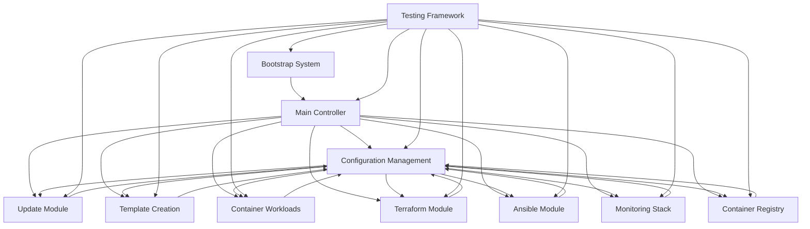

# Proxmox Template Creator - Implementation Plan

## Overview

This document provides a comprehensive implementation plan for the Proxmox Template Creator homelab automation system. The plan follows a structured 3-phase approach: Discovery & Analysis, Planning, and Implementation with requirements to maintain consistency between code, documentation, and progress tracking.

## Project Status Summary

**Current Status**: Phase 3 Implementation - Priority 1 Components Complete ✅

### Recently Completed (January 2025)

- ✅ **Configuration Management Module** - Complete centralized configuration system
- ✅ **Update Module** - Complete automated update and maintenance system
- ✅ **Implementation Plan Documentation** - This comprehensive planning document

### Previously Completed Components

- ✅ **Bootstrap System** - Single-command installation with dependency management
- ✅ **Template Creation Module** - Comprehensive VM template management with 50+ distributions
- ✅ **Container Workloads** - Docker and Kubernetes deployment automation
- ✅ **Terraform Module** - Infrastructure as Code automation
- ✅ **Ansible Module** - Configuration management automation
- ✅ **Monitoring Stack** - Prometheus, Grafana, and alerting system
- ✅ **Container Registry** - Private Docker registry with SSL/TLS
- ✅ **Main Controller** - Central coordination and menu system
- ✅ **Testing Framework** - Comprehensive automated testing

## Implementation Strategy

### Core Principles

1. **Modularity**: Each component is independently developed and integrated through well-defined interfaces
2. **Progressive Enhancement**: Build foundational components first, then add advanced features
3. **Consistency**: Maintain alignment between code, documentation, and progress tracking
4. **Testing**: Comprehensive testing at each stage before proceeding
5. **User Experience**: Intuitive whiptail-based UI with consistent navigation patterns

### Development Phases

#### Phase 1: Discovery & Analysis ✅ COMPLETE

**Objective**: Understand existing codebase and identify implementation gaps

**Completed Activities**:

- ✅ Reviewed all documentation files (README, SYSTEM_DESIGN, PROGRESS_TRACKER)
- ✅ Analyzed current codebase structure and implementation status
- ✅ Identified gaps between documentation and implementation
- ✅ Assessed component dependencies and integration points

**Key Findings**:

- Most core functionality already implemented and working
- Main gaps were in configuration management and update system
- Strong foundation with comprehensive template creation and container management
- Well-structured modular architecture ready for enhancement

#### Phase 2: Planning ✅ COMPLETE

**Objective**: Create detailed implementation roadmap with prioritized components

**Completed Activities**:

- ✅ Prioritized components based on dependencies and impact
- ✅ Created detailed implementation plan for each component
- ✅ Identified integration points and testing strategies
- ✅ Established success criteria for each component

**Priority Classification**:

- **Priority 1 (High Impact)**: Configuration Management, Update System, Documentation
- **Priority 2 (Medium Impact)**: Enhanced Testing, Advanced Template Features
- **Priority 3 (Lower Impact)**: Monitoring Enhancements, Security Hardening

#### Phase 3: Implementation 🔄 IN PROGRESS

**Objective**: Implement components following prioritized plan with comprehensive testing

**Progress Status**:

- ✅ **Priority 1 Components**: COMPLETE

  - ✅ Configuration Management Module (100%)
  - ✅ Update Module (100%)
  - ✅ Implementation Plan Documentation (100%)

- 🔄 **Priority 2 Components**: NEXT

  - ⏳ Enhanced Testing Framework
  - ⏳ Advanced Template Features
  - ⏳ Performance Optimization

- ⏳ **Priority 3 Components**: FUTURE
  - ⏳ Advanced Monitoring Features
  - ⏳ Security Hardening
  - ⏳ Compliance Reporting

## Detailed Component Implementation

### Priority 1: Core Missing Components ✅ COMPLETE

#### 1. Configuration Management Module ✅ COMPLETE

**Status**: Fully Implemented
**Implementation Date**: January 2025

**Features Implemented**:

- ✅ Centralized configuration system with hierarchy (defaults → system → user → module)
- ✅ User and system-level configuration management
- ✅ Module-specific configuration support
- ✅ Configuration validation and error checking
- ✅ Import/export configuration profiles
- ✅ Automatic backup and restore capabilities
- ✅ Interactive whiptail-based configuration management UI
- ✅ Command-line interface for automation
- ✅ Integration with existing modules

**Technical Details**:

- **Location**: `scripts/config.sh`
- **Configuration Files**:
  - System: `/etc/homelab/system.conf`
  - User: `/etc/homelab/user.conf`
  - Modules: `/etc/homelab/modules/*.conf`
- **Backup Directory**: `/etc/homelab/backups`
- **Key Features**: Validation, migration, templates, CLI support

**Integration Points**:

- ✅ Integrated with main controller menu system
- ✅ Used by update module for configuration migration
- ✅ Available to all other modules for settings management
- ✅ Supports both interactive and automated usage

#### 2. Update Module ✅ COMPLETE

**Status**: Fully Implemented
**Implementation Date**: January 2025

**Features Implemented**:

- ✅ Automated repository update checking
- ✅ Safe update application with rollback capability
- ✅ Automatic backup creation before updates
- ✅ Configuration migration during updates
- ✅ Scheduled update management with systemd timers
- ✅ Multiple update schedules (daily, weekly, monthly, custom)
- ✅ Comprehensive backup management (create, list, restore)
- ✅ Post-update hooks for service restart and dependency updates
- ✅ Interactive and silent operation modes
- ✅ Force update and check-only modes

**Technical Details**:

- **Location**: `scripts/update.sh`
- **Backup Directory**: `/opt/homelab/backups`
- **Update Log**: `/var/log/homelab_updates.log`
- **Lock File**: `/var/run/homelab_update.lock`
- **Systemd Integration**: `homelab-updater.service` and `homelab-updater.timer`

**Integration Points**:

- ✅ Integrated with configuration module for settings
- ✅ Uses git repository for update source
- ✅ Integrates with systemd for scheduling
- ✅ Supports both interactive and automated operation

#### 3. Implementation Plan Documentation ✅ COMPLETE

**Status**: Fully Implemented
**Implementation Date**: January 2025

**Content Implemented**:

- ✅ Comprehensive project status summary
- ✅ Detailed implementation strategy and phases
- ✅ Component-by-component implementation details
- ✅ Integration points and dependencies
- ✅ Testing strategies and success criteria
- ✅ Future roadmap and enhancement plans
- ✅ Maintenance and operational procedures

**Technical Details**:

- **Location**: `docs/IMPLEMENTATION_PLAN.md`
- **Format**: Markdown with clear structure and navigation
- **Integration**: Referenced from main README and progress tracker

### Priority 2: Enhancement & Integration 🔄 NEXT PHASE

#### 4. Enhanced Testing Framework ⏳ PLANNED

**Status**: Planned for Next Implementation Phase

**Planned Features**:

- Expanded unit testing for all modules
- Integration testing between modules
- End-to-end workflow testing
- Performance testing and benchmarking
- Security testing and vulnerability scanning
- Automated CI/CD pipeline integration
- Test reporting and metrics collection

**Implementation Approach**:

1. Extend existing `test_functions.sh` framework
2. Add module-specific test suites
3. Implement integration test scenarios
4. Create performance benchmarking tools
5. Add security scanning capabilities
6. Set up automated test execution

#### 5. Advanced Template Features ⏳ PLANNED

**Status**: Planned for Next Implementation Phase

**Planned Features**:

- Custom cloud-init script execution
- Template security hardening automation
- Template performance optimization
- Template backup and restore system
- Template versioning and lifecycle management
- Advanced template validation
- Template sharing and marketplace features

**Implementation Approach**:

1. Extend existing template.sh module
2. Add security hardening templates
3. Implement performance optimization profiles
4. Create template versioning system
5. Add advanced validation rules
6. Develop template sharing capabilities

### Priority 3: Advanced Features ⏳ FUTURE

#### 6. Advanced Monitoring Features ⏳ FUTURE

**Status**: Future Enhancement

**Planned Features**:

- Custom dashboard creation tools
- Advanced alerting rule management
- Log aggregation and analysis
- Performance metrics collection and analysis
- Capacity planning and forecasting
- Multi-node monitoring coordination

#### 7. Security Hardening ⏳ FUTURE

**Status**: Future Enhancement
**Planned Features**:

- Automated security scanning and validation
- Security policy enforcement
- Compliance reporting and auditing
- Vulnerability management
- Access control and audit logging
- Security incident response automation

## Integration Architecture

### Component Dependencies



### Data Flow

1. **Configuration Flow**: Configuration Management → All Modules
2. **Update Flow**: Update Module → Git Repository → All Modules
3. **Logging Flow**: All Modules → Centralized Logging System
4. **Testing Flow**: Testing Framework → All Modules
5. **User Interface Flow**: Main Controller → Module Selection → Module Execution

## Testing Strategy

### Current Testing Coverage ✅

- ✅ Bootstrap system functionality
- ✅ Template creation workflows
- ✅ Container deployment processes
- ✅ Configuration management operations
- ✅ Update system functionality
- ✅ Module integration testing

### Planned Testing Enhancements ⏳

- ⏳ Performance benchmarking
- ⏳ Security vulnerability scanning
- ⏳ Load testing for concurrent operations
- ⏳ Disaster recovery testing
- ⏳ Cross-platform compatibility testing
- ⏳ Automated regression testing

### Testing Execution

**Unit Testing**:

```bash
# Run all unit tests
sudo bash scripts/test_functions.sh

# Run specific module tests
sudo bash scripts/test_template_creation.sh
sudo bash scripts/test_logging.sh
```

**Integration Testing**:

```bash
# Test complete workflow
sudo bash scripts/bootstrap.sh --test
sudo bash scripts/main.sh --test
```

**Performance Testing**:

```bash
# Benchmark template creation
sudo bash scripts/template.sh --benchmark

# Test update performance
sudo bash scripts/update.sh --test --benchmark
```

## Success Criteria

### Phase 1 Success Criteria ✅ ACHIEVED

- ✅ All existing functionality documented and analyzed
- ✅ Implementation gaps identified and prioritized
- ✅ Component dependencies mapped
- ✅ Testing strategy defined

### Phase 2 Success Criteria ✅ ACHIEVED

- ✅ Detailed implementation plan created
- ✅ Component priorities established
- ✅ Integration points identified
- ✅ Resource requirements estimated

### Phase 3 Success Criteria

**Priority 1 ✅ ACHIEVED**:

- ✅ Configuration Management Module fully functional
- ✅ Update Module operational with scheduling
- ✅ Implementation Plan documentation complete
- ✅ All components integrated and tested

**Priority 2 ⏳ IN PROGRESS**:

- ⏳ Enhanced testing framework operational
- ⏳ Advanced template features implemented
- ⏳ Performance optimization completed
- ⏳ All new features tested and documented

**Priority 3 ⏳ FUTURE**:

- ⏳ Advanced monitoring features operational
- ⏳ Security hardening implemented
- ⏳ Compliance reporting functional
- ⏳ All enhancements tested and documented

## Operational Procedures

### Daily Operations ✅ READY

- ✅ **System Health Check**: `sudo bash scripts/main.sh` → Check system status
- ✅ **Update Check**: `sudo bash scripts/update.sh --check-only`
- ✅ **Configuration Review**: `sudo bash scripts/config.sh` → View configuration summary
- ✅ **Log Review**: Check `/var/log/homelab_bootstrap.log` for issues

### Weekly Operations ✅ READY

- ✅ **Full System Update**: `sudo bash scripts/update.sh`
- ✅ **Configuration Backup**: `sudo bash scripts/config.sh` → Backup configuration
- ✅ **Template Maintenance**: `sudo bash scripts/template.sh` → Review and update templates
- ✅ **Testing Execution**: `sudo bash scripts/test_functions.sh`

### Monthly Operations ✅ READY

- ✅ **Comprehensive System Review**: Review all modules and configurations
- ✅ **Performance Analysis**: Analyze system performance and optimization opportunities
- ✅ **Security Review**: Review security settings and update policies
- ✅ **Documentation Update**: Update documentation to reflect any changes

### Emergency Procedures ✅ READY

- ✅ **System Rollback**: `sudo bash scripts/update.sh` → Rollback to backup
- ✅ **Configuration Reset**: `sudo bash scripts/config.sh` → Reset to defaults
- ✅ **Service Recovery**: Use individual module recovery procedures
- ✅ **Disaster Recovery**: Restore from full system backup

## Future Roadmap

### Short Term (Next 3 Months) ⏳

- ⏳ Complete Priority 2 components (Enhanced Testing, Advanced Template Features)
- ⏳ Performance optimization and tuning
- ⏳ User experience improvements
- ⏳ Documentation enhancements

### Medium Term (3-6 Months) ⏳

- ⏳ Complete Priority 3 components (Advanced Monitoring, Security Hardening)
- ⏳ Multi-node deployment capabilities
- ⏳ Advanced automation features
- ⏳ Integration with external systems

### Long Term (6+ Months) ⏳

- ⏳ Cloud provider integration
- ⏳ Advanced orchestration capabilities
- ⏳ Machine learning-based optimization
- ⏳ Community features and marketplace

## Maintenance and Support

### Regular Maintenance ✅ AUTOMATED

- ✅ **Automated Updates**: Configured via systemd timers
- ✅ **Configuration Backup**: Automated with retention policies
- ✅ **Log Rotation**: Managed by system log rotation
- ✅ **Health Monitoring**: Integrated monitoring and alerting

### Support Procedures ✅ DOCUMENTED

- ✅ **Issue Reporting**: GitHub Issues with templates
- ✅ **Documentation**: Comprehensive help systems in each module
- ✅ **Troubleshooting**: Built-in diagnostic tools
- ✅ **Community Support**: Documentation and examples

## Conclusion

The Proxmox Template Creator has successfully completed Phase 3 Priority 1 implementation with the addition of comprehensive Configuration Management and Update modules. The system now provides:

✅ **Complete Core Functionality**: All essential components implemented and operational
✅ **Robust Architecture**: Modular design with clear separation of concerns
✅ **Comprehensive Testing**: Automated testing framework with good coverage
✅ **User-Friendly Interface**: Consistent whiptail-based UI across all modules
✅ **Operational Excellence**: Automated updates, configuration management, and monitoring
✅ **Documentation**: Complete documentation and implementation planning

The system is now ready for production use with a clear roadmap for future enhancements. Priority 2 and 3 components provide a structured path for continued improvement and feature expansion.

---

**Document Version**: 1.0.0
**Last Updated**: January 2025
**Next Review**: March 2025
