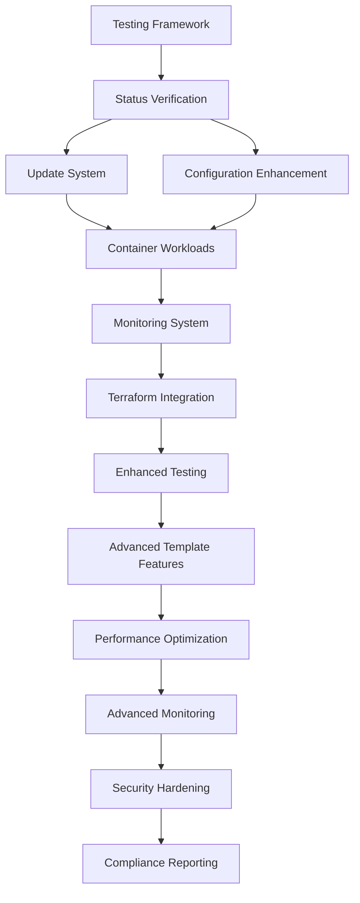

# Proxmox Template Creator - Implementation Plan

## Executive Summary

Based on comprehensive analysis of the existing codebase, this document outlines a structured implementation plan to complete the Proxmox Template Creator project. The analysis revealed a solid foundational architecture with several critical gaps that need to be addressed.

**Analysis Date**: June 9, 2025  
**Project Status**: Foundational components implemented, Priority 1 components need completion  
**Implementation Strategy**: Phased approach focusing on completing core functionality before advanced features

## Phase 1 Analysis Results

### Strengths Identified
- ✅ **Solid Architecture**: Modular design with clear separation of concerns
- ✅ **Comprehensive Template System**: 1896-line template.sh with 50+ distribution support
- ✅ **Advanced Configuration Management**: 1670-line config.sh with hierarchy and validation
- ✅ **Robust Logging System**: Centralized logging with multiple levels and file output
- ✅ **Bootstrap System**: Single-command installation with dependency management
- ✅ **Documentation**: Comprehensive system design and user guides

### Critical Gaps Identified
- ❌ **Testing Framework**: No test files found - critical for reliability
- ❌ **Implementation Status**: Many components marked as "unknown" in progress tracker
- ❌ **Update System**: Module exists but implementation unclear
- ❌ **Monitoring System**: Only skeleton implementation
- ❌ **Integration Testing**: No end-to-end validation

## Implementation Strategy

### Phase 2: Foundation Completion (Priority 1)
**Duration**: 1-2 weeks  
**Focus**: Complete core functionality and establish testing framework

#### 2.1 Testing Framework Implementation
**Priority**: CRITICAL - Highest
- Create comprehensive test suite for all modules
- Implement unit tests for each component
- Add integration tests for end-to-end workflows
- Set up automated test execution

#### 2.2 Status Verification and Documentation Update
**Priority**: HIGH
- Audit all existing modules to determine actual implementation status
- Update PROGRESS_TRACKER.md with accurate status information
- Complete any partially implemented Priority 1 components
- Validate all documented functionality works as described

#### 2.3 Update System Completion
**Priority**: HIGH
- Complete update.sh module implementation
- Add rollback capabilities
- Implement scheduled update management
- Add backup management for updates

#### 2.4 Configuration Management Enhancement
**Priority**: MEDIUM
- Validate configuration hierarchy works correctly
- Implement configuration migration capabilities
- Add validation for all configuration parameters
- Create configuration templates

### Phase 3: Core Module Completion (Priority 1 Continued)
**Duration**: 2-3 weeks  
**Focus**: Complete remaining Priority 1 components

#### 3.1 Container Workloads Module
**Priority**: HIGH
- Complete containers.sh implementation
- Add Docker stack deployment
- Implement Kubernetes workload management
- Add container registry integration

#### 3.2 Monitoring System Implementation
**Priority**: HIGH
- Complete monitoring.sh implementation
- Deploy Prometheus, Grafana stack
- Add alerting configuration
- Implement health checks

#### 3.3 Infrastructure as Code Integration
**Priority**: MEDIUM
- Complete terraform.sh integration
- Enhance existing Terraform modules
- Add Ansible playbook integration
- Create workflow automation

### Phase 4: Enhanced Features (Priority 2)
**Duration**: 3-4 weeks  
**Focus**: Advanced features and optimizations

#### 4.1 Enhanced Testing Framework
- Performance testing and benchmarking
- Security testing and vulnerability scanning
- CI/CD pipeline integration
- Test coverage reporting

#### 4.2 Advanced Template Features
- Custom cloud-init script execution
- Template security hardening
- Template lifecycle management
- Template marketplace features

#### 4.3 Performance Optimization
- System performance tuning
- Module performance optimization
- Benchmarking and metrics
- Resource usage optimization

### Phase 5: Advanced Features (Priority 3)
**Duration**: 4-5 weeks  
**Focus**: Enterprise-grade features

#### 5.1 Advanced Monitoring
- Custom dashboard creation
- Advanced alerting rules
- Log aggregation and analysis
- Capacity planning

#### 5.2 Security Hardening
- Automated security scanning
- Security policy enforcement
- Compliance reporting
- Access control and audit logging

#### 5.3 Compliance Reporting
- Audit trail generation
- Compliance dashboards
- Automated reporting
- Policy validation

## Implementation Dependencies

### Critical Path Dependencies

### Component Integration Requirements
- All modules must integrate with centralized configuration system
- All modules must use centralized logging system
- All modules must include comprehensive test coverage
- All modules must support automated updates
- All modules must provide health check endpoints

## Success Criteria

### Phase 2 Success Criteria
- [ ] Complete test framework with 90%+ test coverage
- [ ] All Priority 1 components status verified and documented
- [ ] Update system fully functional with rollback capability
- [ ] Configuration management working across all modules

### Phase 3 Success Criteria
- [ ] Container workloads fully deployable via UI
- [ ] Monitoring stack operational with alerting
- [ ] Terraform integration working for VM deployment
- [ ] All core modules passing integration tests

### Phase 4 Success Criteria
- [ ] Performance benchmarks established for all modules
- [ ] Advanced template features working with security hardening
- [ ] CI/CD pipeline operational
- [ ] System performance optimized

### Phase 5 Success Criteria
- [ ] Advanced monitoring with custom dashboards
- [ ] Security hardening with automated scanning
- [ ] Compliance reporting functional
- [ ] All enterprise features operational

## Risk Mitigation

### High Priority Risks
1. **Testing Gap Risk**: Lack of tests may hide critical bugs
   - Mitigation: Implement testing framework first
   
2. **Integration Complexity**: Module interdependencies may cause conflicts
   - Mitigation: Incremental testing at each phase
   
3. **Performance Issues**: System may not scale well
   - Mitigation: Performance testing and optimization phase

### Medium Priority Risks
1. **Configuration Complexity**: Advanced config may be error-prone
   - Mitigation: Comprehensive validation and testing
   
2. **Update System Reliability**: Failed updates could break system
   - Mitigation: Robust rollback and backup mechanisms

## Next Steps

### Immediate Actions (Next 24 Hours)
1. **Create Test Framework Structure**: Set up test directories and basic framework
2. **Audit Module Status**: Run existing modules to determine actual functionality
3. **Create Test Scripts**: Begin with unit tests for logging and configuration modules
4. **Update Progress Tracker**: Mark components as verified or needs implementation

### Week 1 Goals
- Complete testing framework implementation
- Verify and document all existing module functionality
- Begin update system implementation
- Start configuration management validation

---

**Document Version**: 1.0.0  
**Last Updated**: June 9, 2025  
**Next Review**: June 16, 2025  
**Status**: APPROVED - Ready for Implementation